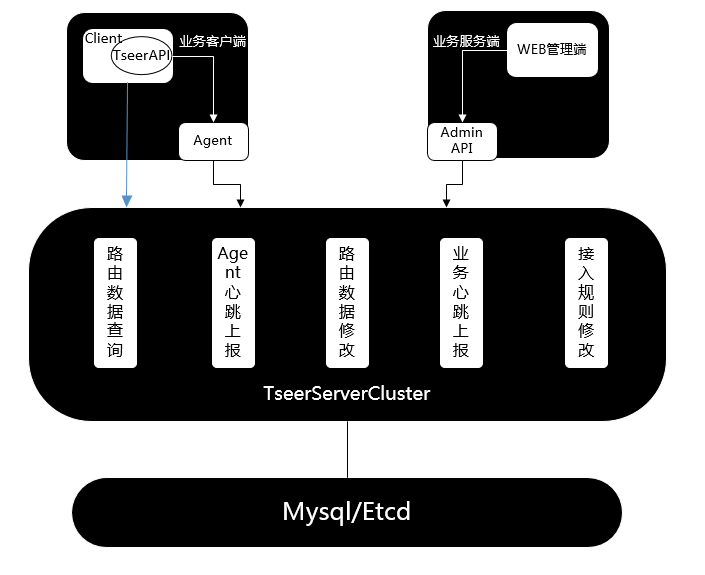
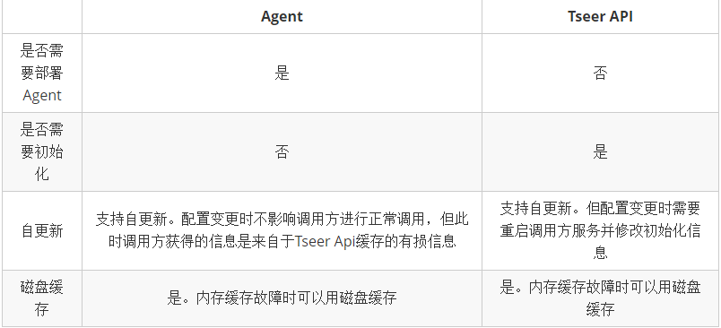

# Tseer产品介绍

# 目录
> * [1.Tseer简介](#ch-1)
> * [2.研发背景](#ch-2)
> * [3.Tseer架构](#ch-3)
> * [4.Tseer功能特性](#ch-4)

## 一. Tseer简介

Tseer是一套解决多框架服务集群之间服务发现的工具，基于名字进行路由实现，性能优越，接入友好，在腾讯内部被广泛采用，目前日均承载百亿级别的请求量。

在服务发现的核心功能之上，Tseer还支持多种优秀的负载均衡算法，提供可靠的故障容错策略。针对发展迅速的海量服务，还支持就近接入，按SET逻辑分组，全量调度三种不同的路由策略。实现了高度智能的调度优化，有效解决了业务跨地区跨机房调用等业界难题，最大化保证了服务的可用，对业务质量有显著提升。

Tseer拥有web管理界面和API接入两种方式可供用户根据需求自由选择，通过代理节点和代理服务器机制为需要频繁发布变更的业务提供透明的服务发现功能，学习成本很低，操作也很方便，对于业务维护人员十分友好。

同时Tseer轻巧灵便，以旁路模式工作，对业务的侵入性突破业内新低，无论新业务还是已经上线的业务都十分适用，极其友好。是微服务框架和分布式服务集群实现服务发现的优秀解决方案。

## 二. 研发背景

在传统的单体式应用中，变更发布相对较少，系统中的网络位置也很少变化，偶尔的变更也可以通过手动更改配置的方式来应对。但是在当前海量服务的大环境下，这种架构已经无法高效稳定的支撑高速增长的业务。越来越庞大的分布式服务集群和微服务框架已经逐渐成为主流。

但是新型架构为业务提供更好支撑的同时，频繁的发布更新与动态伸缩也导致了网络位置的频繁变化，在这种情况下业务维护人员手动更改配置这种大规模重复性工作不仅增大了出错的风险，其低效也会限制业务的高速发展。往往配置还没改完，新的变更就需要发布了。所以就必须要一个自动化的服务发现工具来解决这些问题。

然而这些也并不是问题的全部。在保证访问成功的前提下，响应时间作为服务质量中最重要的指标，是影响业务发展最关键的一环。多业务集之间复杂的调用关系再加上跨地区跨网络调用等其他因素，响应时间达不到预期是持续困扰整个业务发展周期的棘手问题。与此同时，无论是采用物理机还是虚拟机，节点挂掉导致的不可用时有发生，如何有效容错也是亟待解决的问题。

基于这些问题，我们开发出了Tseer。

## 三. Tseer架构

整个Tseer的结构分为三部分：Tseerserver、业务客户端（主调）、业务服务端（被调）。

* Tseerserver

   Tseerserver是整个Tseer的枢纽与核心模块。
   当新节点上线时，需要先通过WEB管理平台在Tseer服务集群注册，将其网络位置信息记录在Tseer系统中。当需要对节点进行下线或者其他修改时，也需要在WEB管理平台就行相关操作。被调节点也会定时上报心跳给Tseerserver，server端会屏蔽心跳超时的节点使其无法被调用。

* 业务客户端

   业务客户端是需要调用其他服务的节点，称之为主调，是服务发现功能的使用者。
   Tseer为业务客户端提供了：安装Agent与API调用两种方式来从Tseerserver获得需要调用的服务（被调）的地址来完成调用。

* 业务服务端

   业务服务端是需要被调用的节点，称之为被调，是服务的提供者。
   当新节点上线时，被调需要在Tseerserver注册。不论同一个被调服务集群有多少个节点，注册时该服务集群都需要注册一个统一的名字。主调在调用逻辑中只需要写明需要调用的服务的名字，Tseer会根据被调名字来返回被调地址。当被调需要扩容时，只需要把新节点加在该服务对应的名字下面即可。业务人员无需管理被调集群下繁多的服务节点信息，十分方便。

## 四. Tseer功能特性

### 1.负载均衡

当同一业务集群中某些节点被频繁调用而另一些节点没有承担合理的负载时，不仅业务的服务质量和响应时间会大幅下降，同时也会造成资源的浪费。

Tseer系统中，当主调发起调用时，会针对被调名字下所有可用节点为调用提供四种负载均衡方式来保障各个节点的合理负载，分别是

* 轮询
* 随机
* 静态权重
* 一致性哈希

用户还可以使用调用分组的方式来自定义负载均衡实现，调用分组会在下文中提到。

### 2.故障容错

为了解决节点故障导致的业务不可用与服务质量降低，Tseer还提供了可靠的故障容错机制。

当主调进行一次调用之后，会将调用结果上报。如果调用失败Tseer会暂时将该节点屏蔽来避免故障节点被反复调用，Tseer会定时探测被屏蔽的节点，当发现故障节点恢复服务时，会重新将其激活。

> 对于任意被调节点，满足下列条件之一则屏蔽该节点：
>
> 1.在一个检测周期（60秒）内调用失败次数达到2次，且调用错误数占总调用次数的50%以上
>
> 2.在5秒内连续调用失败5次以上

对于被屏蔽的节点Tseer Agent/Api将每隔30秒对已屏蔽的节点进行重试。

同时当Tseer故障时，主调也能根据缓存信息继续调用。

### 3.调用优化

Tseer为调用逻辑提供IDC分组、Set分组、All三种方式来解决跨地区调用等问题。

* All

  为主调提供所有可用被调节点地址

* IDC分组

 IDC分组可以近似的看作就近接入。

该方法按照两个层次进行划分。第一个是物理小组，是最小的组调度单位，即按照节点所在的机房或者区域分配统 一的组名。第二个是物理小组组成的逻辑组，可以理解为按照更大的区域来划分的统一的组名。

针对IDC的逻辑分组，Tseer还定义了调用优先级策略。即部分逻辑组不可用时，会按照优先级策略返回可用被调节点地址列表。

* Set分组

IDC分组主要是在区域概念上去划分分组，实现就近访问策略，在后台服务架构中，业务规模达到一定数量时，如果要对某几个服务节点实现根据容量、灰度，分区域管理的隔离控制，IDC分组是无法满足的，而Set分组则是对IDC分组的再细化。

Set分组的命名规则为： Set名.Set地区.Set组。其中Set组是最小区分单元的名称，支持通配符*，表示Set地区下的所有分组。比如0,1,2,3,4或者a,b,c,d。

Set分组的调用逻辑如下：

1.主调（客户端）和被调（服务端）都启用了Set分组，并且Set名要一致才认为是启用同SET内

2.启用Set分组的主调和被调只能访问同Set内的节点

3.主调启用Set分组，被调没有启用Set分组，则默认会走按IDC分组查询的逻辑（前提是启用了IDC分组）

### 4.两种接入方式

根据服务客户端是否在其物理机中部署Tseer Agent，Tseer的使用方式可以分为Agent 和Tseer API两种方式：

- Agent 方式

**名字路由**

Agent 方式下，Tseer Agent会定期缓存被调方的信息。并根据调用方指定的负载均衡策略将被调节点信息返给调用方。如果调用方希望通过服务特性来实现负载均衡，Tseer也支持按照调用方指定的分组策略将被调的组信息返给调用方。

**数据上报**

每次调用完成后，调用方需要调用Tseer Api提供的上报接口上报调用信息，调用信息将由Tseer Api即使上报至Tseer Agent。Tseer Agent将根据调用信息剔除失效被调节点。

**容错**
使用Agent 方式时，如果Tseer Agent失效，Tseer Api将会从内存中返回已访问过的节点给主调，如果Tseer Api缓存失效，此时Tseer Api将会从本地磁盘中的缓存文件恢复缓存信息提供给主调。需要注意的是此时Tseer Api提供给主调服务的信息为有损信息，Tseer Api不保证节点一定健康。

- Tseer Api方式

**名字路由**

Agent 方式与Tseer Api方式的区别在于是否需要在主调的宿主机中部署Tseer Agent。Tseer Api会直接访问Tseer server。并且被调方信息缓存、负载均衡以及失效节点剔除都在Tseer Api中完成。

Tseer Api会定时拉取Tseerserver的后端信息并屏蔽不可用的被调节点。

**容错**

Tseerserver故障时，Tseer Api会将内存中缓存的信息返回给主调。当内存缓存不可用时，Tseer Api将会用本地磁盘中的缓存恢复内存缓存。

**Agent Api方式 与Tseer Api方式对比**

