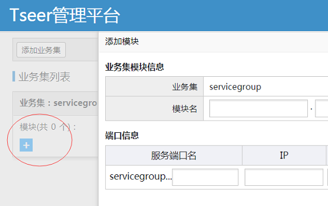

# TSeer 安装指引

## 依赖环境

软件 |软件要求
------|--------
linux内核版本:      |	2.6.18及以上版本（操作系统依赖）
gcc/g++版本:       	|   4.8.1及以上版本 (支持c++11)、glibc-devel（c++语言框架依赖,源码编译依赖）
bison工具版本:      |	2.5及以上版本（c++语言框架依赖,源码编译依赖）
flex工具版本:       |	2.5及以上版本（c++语言框架依赖,源码编译依赖）
cmake版本：       	|   2.8.8及以上版本（c++语言框架依赖,源码编译依赖）
resin版本：       	|   4.0.49及以上版本（web管理系统依赖,源码编译依赖）
Java JDK版本：      | 	web管理系统（最低1.8）
Maven版本：			|   2.2.1及以上版本（web管理系统、java语言框架依赖）
rapidjson版本:      |   1.0.2版本（c++语言框架依赖,源码编译依赖）

运行服务器要求：1台安装linux系统的机器即可。

## 1. 安装方式选择

Tseer暂时只提供源码编译方式安装,可定制性强,由于一键安装脚本的便捷,安装并不麻烦。

**注意:** 安装过程中需要使用wget和curl等工具.

#### 源码安装

需要预先安装python, g++, cmake, wget, curl, flex, bison，确保机器网络正常，能够克隆github的仓库.

## 2. Tars
   TSeer依赖[Tars](https://github.com/Tencent/Tars).
   在源码一键安装中已经包括了Tars的自动下载和编译安装，所以**不需要**你关心Tars的部署。

   **注意:** 源码编译Tars需要提前安装好flex和bison.

## 3. 源码安装

#### 注意

- 安装一定要`cd build/`执行安装脚本
- 安装目录和源码目录不要重叠。

### 下载源码

使用git下载：git clone https://github.com/Tencent/TSeer.git

1. 编辑配置文件: vim build/tseer_deploy.ini,修改install_type=source,使用源码安装方式（详细用法请参考章节4,编辑好之后再执行第二步）
2. 执行安装：cd build; python tseer_deploy.py


## 4. 编辑安装配置

安装配置文件的位置： tseer/build/tseer_deploy.ini

### 4.1 tseer基础配置：

```ini
[tseer]
; install_type: bin, source; default: bin.
; binary install: place binary executable to your set base path
; source install: depend tars
install_type=bin
; storage: etcd, data storage.
storage=etcd
base_dir=/usr/local/
bind_ip=localhost
```

- install_type 安装方式：  源码安装选择source，将会进行编译安装； 二进制安装则直接使用git上已经编译好的binary包安装。
- base_dir 安装路径：服务将安装你指定目录下的tseer目录。
- bind_ip TseerServer/TseerAgent监听地址：默认是本机的IP。

### 4.2 tseer server配置：

```ini
[tseer_server]
; agent registry and report heartbeat
regport=9902
; query service ip and port
queryport=9903
; admin port
apiport=9904
```

- regport: tseerAgent注册、上报心跳到tseerserver的端口，以及web上传agent发布包的端口
- queryport：服务路由信息查询端口
- apiport：管理平台web增删改查路由数据和管理tseeragent的端口

### 4.3 存储介质配置


#### 4.3.1 Etcd配置

```ini
[etcd]
; host_list: localhost or like 10.0.0.1,192.168.0.10, 172.168.10.1
; localhost: start local 3 etcd instance
;host_list=localhost
client_port=2379
cluster_port=2380
base_dir=/data/test/etcd/
```

- host_list:  部署etcd的主机列表，默认启动三个etcd实例。远程安装依赖paramiko库，请自行安装。
- client_port: 访问的接口
- cluster_port: etcd集群内部通信端口

其中etcd member名字默认是`tseer_etcd`加上序号，不可配置


## 5. 部署web平台

一键安装脚本中并不包括web平台的部署,需手动操作,这里补充如下:


先从[这里](http://caucho.com/download/resin-4.0.49.tar.gz)下载resin安装包。
将resin包解压在build/目录下

```
cd build/
tar xvf resin-4.0.49.tar.gz
mv resin-4.0.49 resin
```

修改查询路由的地址
```
cd web # 进入到源码的web目录下
vi src/main/resources/seer.conf
```
将locator的地址改为你所配置的tseer绑定地址及queryport号，默认端口是9903


修改配置中TSeer服务地址，修改方法如下
```
cd web # 进入到源码的web目录下
vi src/main/resources/system.properties
```
将seer.api.url和seer.agent.onekey.install.url的值修改成你部署的TseerServer监听ip及4.2节配置的apiport

例如，如果tseer的bind_ip配置的是localhost,端口是9904,那么这样修改即可：
`seer.api.url=http://127.0.0.1:9904/v1/interface`


现在开始生成我们的war包:执行下面命令后,可以在target目录下看到`seer-1.0.0-SNAPSHOT.war`文件,
将其拷贝到resin的webapps目录下

```
cd web  # 进入到源码web目录下,有pom.xml文件,准备执行mvn命令
mvn clean
mvn install
cp target/seer-1.0.0-SNAPSHOT.war ../build/resin/webapps/ 
```

设置resin运行入口

```
vi conf/resin.xml

在这句注释下面`webapps can be overridden/extended in the resin.xml`
替换添加
<web-app id="/" root-directory="webapps/seer-1.0.0-SNAPSHOT"/>
```

启动resin
在resin目录下，执行

```
./bin/resin.sh start
```


## 6. 开始体验tseer

### 6.1 访问管理平台

resin默认端口是8080，所以在你的浏览器输入 http://127.0.0.1:8080 即可（ip替换成真实绑定的ip）


### 6.2 添加路由数据

- 在页面右上角，点击`业务集列表`


- 进入后点击`添加业务集`，输入业务集名称


- 添加模块



- 添加具体路由对象

 tseer的路由名称是四段式的：业务集.业务名.服务名.端口名，添加业务集时已经确认了业务集名字，
 在添加模块时候，还需要填写剩下的三段名字。如图所示，填写的业务名是app，服务名是server，端口名是helloobj


### 6.3 使用API获取路由数据

tseer提供C++、Java的API,路径放在预设安装路径下的api目录下

如何使用，请查看相应API使用教程和实例

[c++ api](docs/cplus-api-quickstart.md)

[java api](docs/seer-api-java-quickstart.md)


## 7. 安装TseerAgent

一键脚本默认安装启动了TseerAgent进程，但是如果你还要在其它机器部署服务，那就需要自行安装了.

一键脚本在源码的build目录已经打包好了后缀为tgz的agent包，首先需要上传。

### 7.1 web页面操作上传添加agent安装包

- 在web页面右上方选择`发布包管理`，然后在左侧选择上传TSeerAgent发布包，如下图.


### 7.2 web页面操作生成下载agent的命令

- 在web页面右上方选择`Agent安装工具`，填入目标机器IP，生成命令后，复制并在目标机器上粘贴执行。
生成的命令类似于：

```
wget http://10.17.89.41:9904/installscript && python installscript --innerip=10.17.89.35
```
  其中10.17.89.41是你执行一键脚本所在的机器，innerip则是你的目标机器

  **注意** 一般来说还需要指定os版本,格式形如CentOs-7.2-64,不然无法下载agent包。所以最终命令类似:
```
wget http://10.17.89.41:9904/installscript && python installscript --innerip=10.17.89.35 --os=CentOs-7.2-64
```

### 7.3 登陆目标机器，执行上面的命令

   执行命令完成后，使用ps命令或netstat查看agent进程是否启动成功

